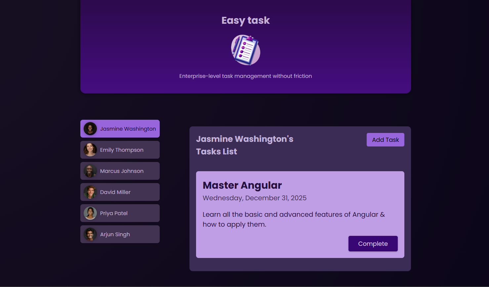
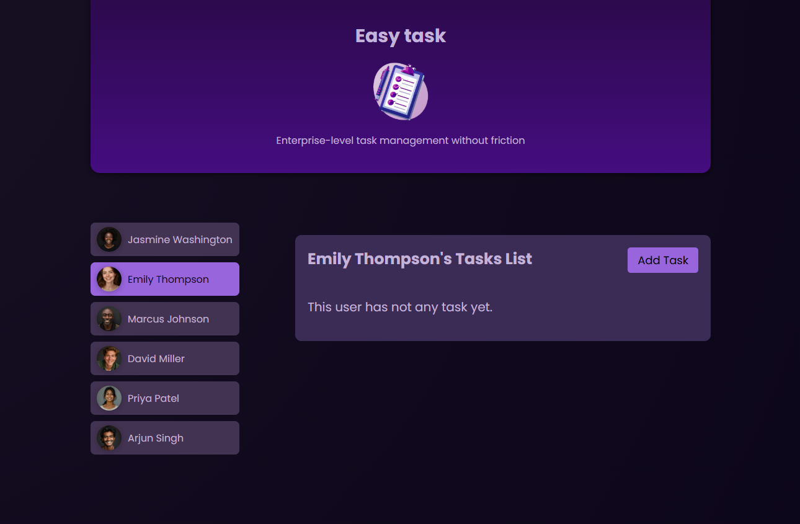
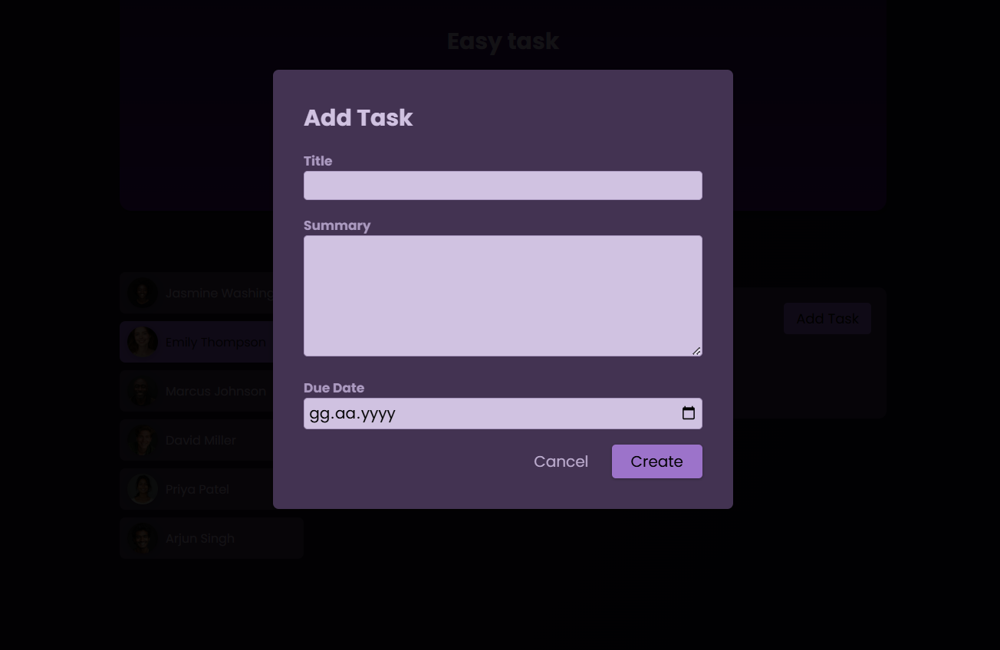

# 📝 Angular Signal-Based Todo App

This project was generated with [Angular CLI](https://github.com/angular/angular-cli) version 18.2.12.

## 🚀 Getting Started

Follow the steps below to set up and run this project on your local machine:

1. **Clone the repository** to your local machine.
2. Run the following command to install the required dependencies:
   ```bash
   npm install
   ```
3. Start the development server:
   ```bash
   ng serve
   ```

---

## 📚 Project Description

This project consists of a **signal-based Todo App** built with Angular. Users can:

- Select a person from the list.
- Assign tasks to the relevant person.
- Add new tasks dynamically.

The app uses **Angular Signals** to manage the state efficiently.

---

## 🎯 Features

- 🧩 **Signal-based state management** for optimized performance.
- 📋 **Task assignment functionality** to manage tasks for different users.
- ➕ **Add new tasks** easily through the user interface.

---

## 💻 Technologies Used

- Angular CLI 18.2.12
- TypeScript
- HTML & CSS

---

## 🖼️ Screenshots

*Add your project screenshots here for better visualization.*

```markdown

```

```markdown

```

```markdown

```

---

## 📄 License

This project is licensed under the **MIT License**.
